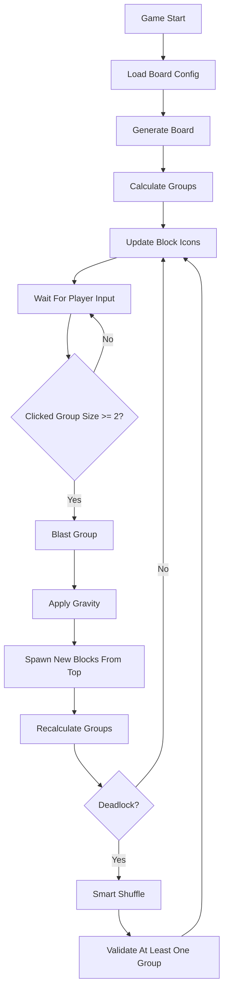

# Unity Blast / Collapse Game Case

A 2D tile-matching puzzle game developed in Unity, fulfilling the requirements for a blast/collapse mechanic case.

## Case Requirements
- **Configurable Board:** Row (M) and Column (N) size can be adjusted between 2 and 10.
- **Configurable Colors:** The number of block colors (K) is dynamic (1 to 6).
- **Match Detection:** Clicking any block finds adjacent blocks of the same color. Groups of 2 or more can be blasted.
- **Gravity & Refill:** After a blast, upper blocks fall down seamlessly. New blocks are generated off-screen and drop to fill empty spaces.
- **Dynamic Icons:** Block visuals (icons) update based on the size of the contiguous group. Configurable A, B, and C thresholds change the icon state dynamically.
- **Deadlock Detection:** Automatically detects when no valid moves (group of 2+) exist on the board.
- **Deterministic Shuffle:** When a deadlock occurs, the board is smartly shuffled ensuring that at least one valid blastable group is formed. It never relies on a blind random shuffle.
- **Optimization:** Object pooling is implemented to prevent performance hitches from continuous Instantiate/Destroy calls.

## Gameplay
The player interacts with the game by clicking on blocks. If a clicked block is part of a group of 2 or more blocks of the same color, the entire group "blasts" (disappears). The blocks above fall down due to gravity, and new blocks spawn from the top to fill any remaining empty spaces. The game ensures the player never gets stuck by smartly shuffling the board if a deadlock occurs.

## Features
- **Configurable Board Size** (2x2 up to 10x10)
- **Configurable Color Count** (1 to 6 colors)
- **BFS-Based Group Detection**
- **Efficient Object Pooling**
- **Gravity & Refill System**
- **Group-Size Based Dynamic Icon Updates**
- **Deadlock Detection & Smart Shuffle Solution**
- **Clean and Maintainable Architecture**

## Project Architecture
- **`BoardManager.cs`**: The core controller of the game. It manages object pooling, board generation, user input (raycasting), breadth-first search (BFS) for group detection, gravity execution, dynamic icon state updates, and deadlock detection with the smart shuffle logic.
- **`Tile.cs`**: A simple data container attached to each block prefab, tracking its `x` and `y` logical grid coordinates and its current `Color`.
- **`TileVisual.cs`**: Handles the visual representation of the block. It listens for threshold updates from the BoardManager and dynamically swaps out the `SpriteRenderer` sprite based on the current group tier.

## Folder Structure
```text
Assets/
  _Project/
    Scenes/
      MainScene.unity
    Scripts/
      Core/
        BoardManager.cs
      Board/
        Tile.cs
      Blocks/
        TileVisual.cs
    Prefabs/
      Block.prefab
    Sprites/
      BlockSprite.png
      Square.png
    Documentation/
```

## Game Flow


